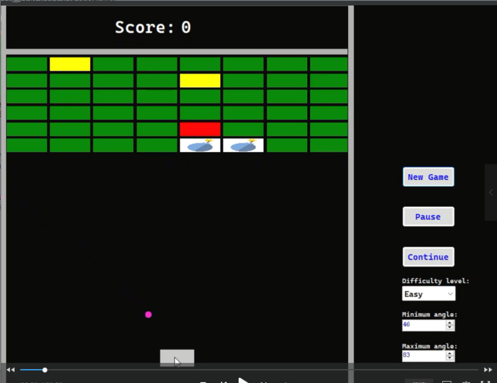
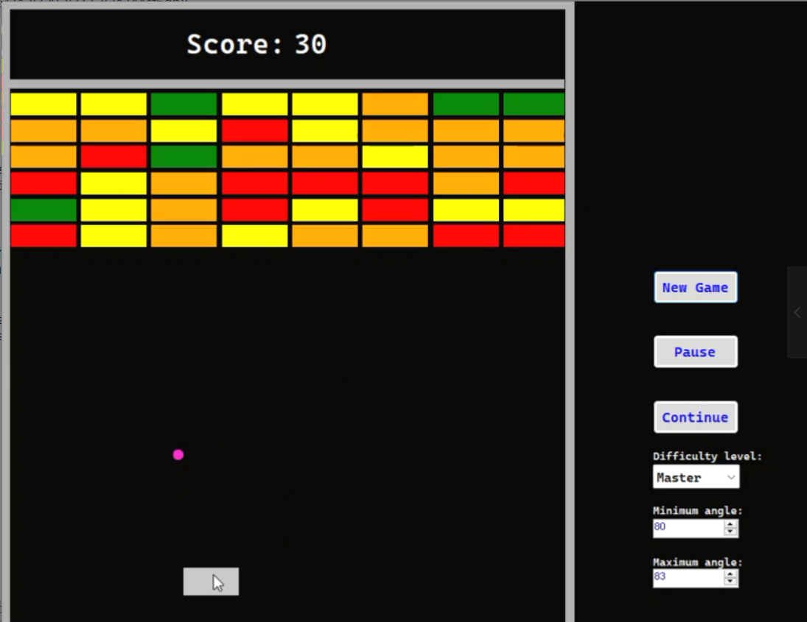

# Game_Brickout
This small game which is adapted from Brickout in 1976 is an assignment of GUI course. This mini game is developed in C#.

## 📹 Demo Videos

 [Click here to watch the demo video on YouTube]
👉https://youtu.be/R24uTHfn9oY

## 🎮 Screenshot

